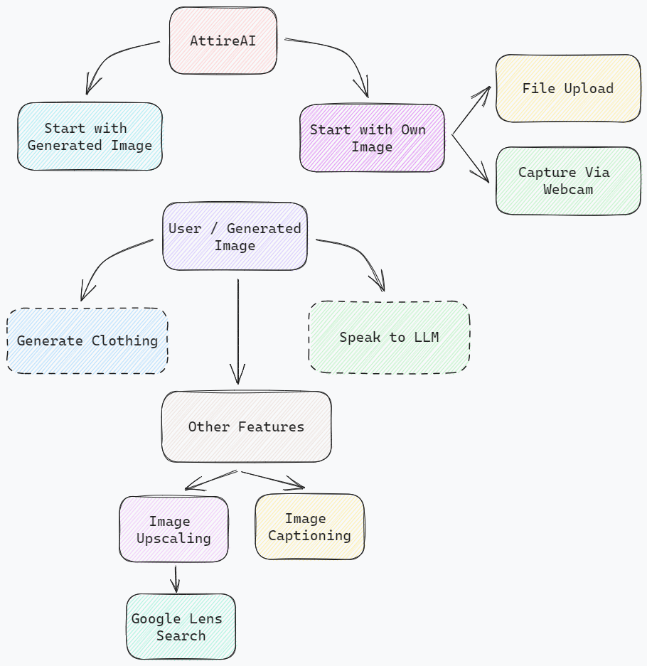
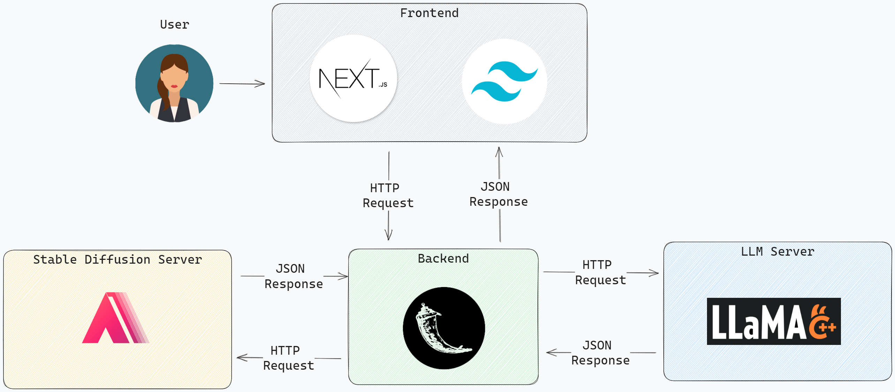
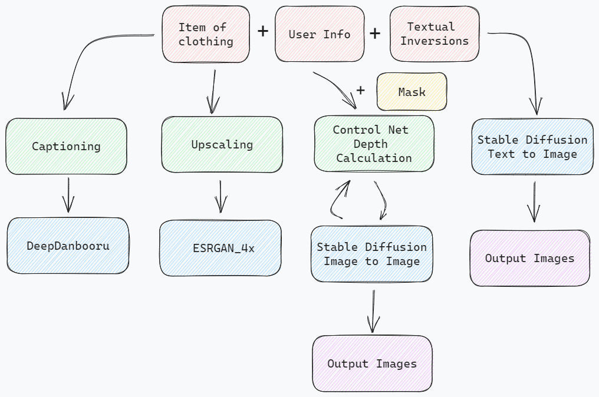

# Deliverables

- A functional and user-friendly fashion outfit generator that leverages Generative AI technology to provide personalized and on-trend outfit recommendations to users.
- The ability to analyze a user’s past purchase history, gender, and insights from fashion trends to offer outfit suggestions tailored to the user.
- The ability for users to interact with the outfit generator in a natural conversational way, providing feedback and tweaking the outfits as desired.
- The integration of the fashion outfit generator into an e-commerce platform, enhancing the user’s shopping experience by providing them with personalized, and trendy outfits.

# Use Cases
1. Shopping: Users can use Attire AI to find outfits for specific occasions, such as a job interview, a wedding, or a night out. Attire AI can also help users find outfits that fit their style.
2. Styling: Users can use Attire AI to get styling tips and inspiration. Attire AI can help users learn how to combine different clothing items and styles to create unique stylish and cohesive outfits easily.
3. Performance: Attire AI can be used to personalize the shopping experience for each user. It can take into account the user's past purchase history and social media trends to suggest outfits that are tailored to  their individual preferences.

# Website Flow
\

# Bird's Eye View
\

# Generate Clothing
\

# Speak to LLM
\
